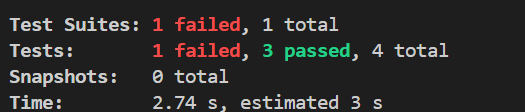
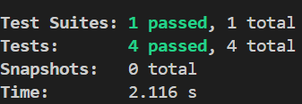
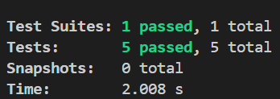

# Unit Testing Documentation

This document provides an overview of the unit tests implemented for the different components of the application.

## CreateOrder Component

The `CreateOrder` component is responsible for creating purchase orders. The following unit tests have been implemented:

### Test Cases

1. **Displays loading state at first**: Confirms that the component shows a loading message while it’s getting the initial data from the API.
2. **Presents unauthorized message for non-purchase managers**: Verifies that the component shows an unauthorized message if the user isn’t a purchase manager.
3. **Fetches and shows vendors and branches**: Makes sure the component retrieves and displays the list of vendors and branches after the loading phase.
4. **Manages API errors**: Checks that the component deals with and logs API errors smoothly.

### Testing Approach

- The tests make use of Jest and React Testing Library to render the component and interact with it.
- Axios is mocked to simulate API requests and responses.
- The `useSession` hook from `next-auth/react` is also mocked to offer various user roles for testing purposes.
- Additionally, the `useRouter` hook from `next/router` is mocked to imitate navigation actions.

## ManageMemberships Component

The `ManageMemberships` component is responsible for managing member subscriptions. The following unit tests have been implemented:

### Test Cases

1. **Shows loading state at first**: Confirms that the component shows a loading message while it’s getting members and subscription plans from the API.  
2. **Displays members post-loading**: Makes sure the component shows the list of members once the data is successfully retrieved from the API.  
3. **Opens a modal on member click**: Verifies that clicking on a member brings up a modal for changing the membership type.  
4. **Manages error state**: Checks that the component properly handles and shows an error message when API requests don’t go through.  

### Testing Approach

The testing approach for the `ManageMemberships` is the same as that for the `CreateOrder` component.

## PaymentReconciliation Component

The `PaymentReconciliation` component is responsible for reconciling payments. The following unit tests have been implemented:

### Test Cases

1. **Shows loading state at first**: Confirms that the component shows a loading message while it’s getting payment data from the API.  
2. **Displays payments after loading**: Makes sure the component shows the list of payments once the data is fetched successfully from the API.  
3. **Manages error state**: Checks that the component properly handles and shows an error message if the API request doesn’t go through.  
4. **Opens adjustment modal on adjust button click**: Tests if clicking the "Adjust" button brings up a modal for modifying the payment.  
5. **Successfully submits payment adjustment**: Ensures that the component can successfully submit the payment adjustment when the form is completed and sent.  

### Testing Approach

The testing approach for the `PaymentReconciliation` component is the same as that for the `CreateOrder` component.

## Conclusion

Unit tests tackle a bunch of different situations to make sure the components work as they should. They check how things render, how users interact with them, and how errors are handled. Keeping a solid set of unit tests helps us spot any problems early on, which keeps the app stable and reliable.

The testfile names and scores are as follows:

- `CreateOrder.test.tsx`: 4/4

- `ManageMemberships.test.tsx`

- `Payment-reconciliation.test.tsx`

